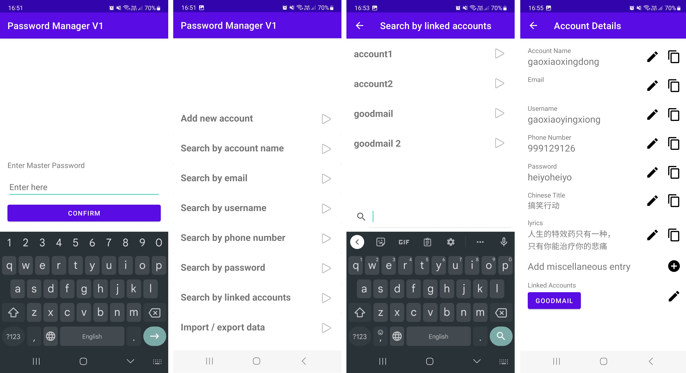

# Password Manager for Android

A simple password manager for android devices with API level 30 and above (Android 11)

## Features

1. For each account, stores:
    - Account Name
    - Associated Email (Optional)
    - Associated Username (Optional)
    - Associated Phone Number (Optional)
    - Associated Password (Optional)
    - Associated Linked Accounts (Optional)
    - Other miscellaneous information (Optional)

2. Search across all accounts based on:
    - Email
    - Username
    - Phone Number
    - Password
    - Linked Accounts

3. Secures app with:
    - master password input (created at startup)
    - Biometric fingerprint registered on phone

4. Import and Export account data through PBDF2 encryption using master password

## Motivation
Shiyao's personal project. Made to sync with data from the command line password manager. The design decision to allow searching across different variables such as passwords and phone number came from the necessity of monitoring and updating accounts that use that variable. 

Also to answer to my younger self who mistakenly thought that getting a CS degree would allow me to learn to whip up an app. 